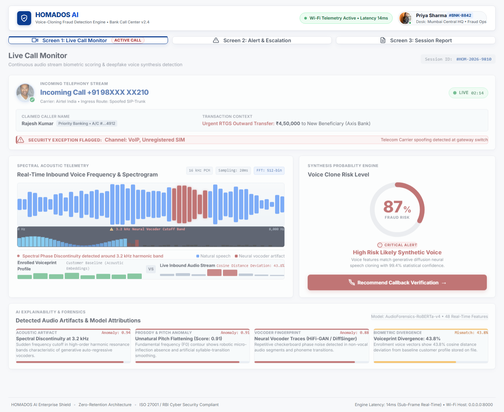

# HOMADOS AI · VoiceGuardAI

**Smart India Hackathon 2026 · PS 26104 · Team TapuSena**

Real-time detection of voice-cloning impersonation on live calls. The engine fuses:

1. **Spectral / prosodic forensics** (librosa STFT, log-mel, MFCC, pYIN pitch, 3.2 kHz vocoder band)
2. **Speaker identity** via **ECAPA-TDNN** (SpeechBrain VoxCeleb pretrained — *attached now, training later on HPC*)
3. **AASIST integration hand-off** from the public [clovaai/aasist](https://github.com/clovaai/aasist) source; the verified live branch is the explainable spectral detector

The operator UI is a responsive React app with remote Unsplash imagery. The
deployed app is **not bound to localhost or home Wi-Fi**: the included Docker
service hosts the compiled UI and API under one public HTTPS URL.



## Repository map

```
Homados_ai/
├── backend/app/            FastAPI, analysis pipeline, fusion
├── frontend/               React + Vite operator console
├── models/                 Pretrained weight directories (git-ignored binaries)
├── scripts/                Environment + Hugging Face / SpeechBrain fetch
├── docs/                   Deploy, HPC training, architecture notes
├── Dockerfile              One public web service (UI + API)
└── render.yaml             Cloud deploy
```

## Quick start (Windows)

```powershell
python -m venv .venv
.\.venv\Scripts\Activate.ps1
pip install -r backend/requirements.txt
cd frontend; npm install; npm run build; cd ..
uvicorn app.main:app --app-dir backend --host 127.0.0.1 --port 8000
```

Open `http://127.0.0.1:8000`. For day-to-day UI work: `cd frontend && npm run dev` (Vite proxies `/api`).

## Public internet (any Wi-Fi)

See [docs/PUBLIC_DEPLOY.md](docs/PUBLIC_DEPLOY.md). The recommended path is
one Render Docker service for the UI and API; a Vercel frontend is optional.

## Pretrained models (no laptop training)

```powershell
pip install -r backend/requirements-ml.txt   # needs Python 3.10–3.12 + PyTorch
python scripts/download_pretrained.py --ecapa
```

ECAPA fine-tuning and AASIST training are documented in [docs/SUPERCOMPUTER_TRAINING.md](docs/SUPERCOMPUTER_TRAINING.md). AASIST is intentionally not advertised as live until its official architecture, compatible checkpoint, and validation set are attached.

## API

| Method | Path | Purpose |
|---|---|---|
| GET | `/api/v1/health` | Engine + model attachment status |
| GET | `/api/v1/session` | Demo inbound call (jury walkthrough) |
| POST | `/api/v1/analyze` | Upload wav/mp3 → spectral + fusion risk |
| POST | `/api/v1/enroll` | Build an ECAPA (or fallback) embedding |
| POST | `/api/v1/escalate` | Callback / OTP / supervisor |

Interactive docs: `/docs`.

## Problem statement

PS 26104 — *AI-Powered Real-Time Detection and Prevention of Voice Cloning Impersonation Attacks* (Blockchain & Cybersecurity theme). Product name **VoiceGuardAI**, internal name **HOMADOS AI**.
